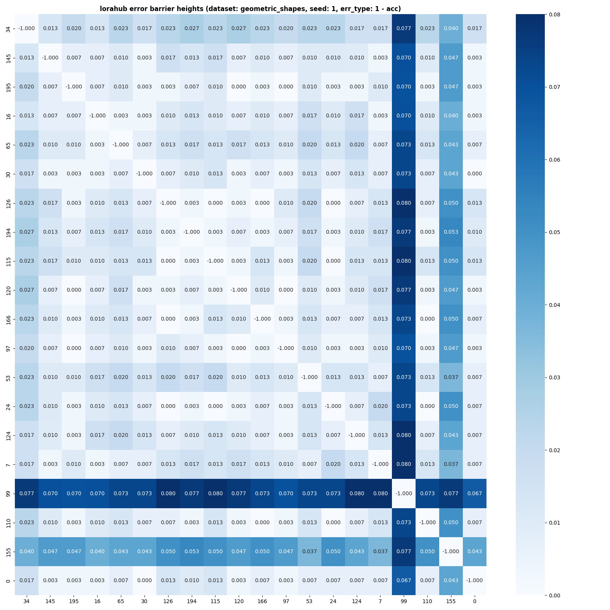

# LoraHub: Efficient Cross-Task Generalization via Dynamic LoRA Composition

## 실험 및 시각화 구현 코드:
### compute_lmc.py
각 dataset, seed, LoraHub 모듈 조합 별로 linear interpolation coefficient(alpha) 값에 대한 error를 구하고 시각화하는 코드가 구현되어 있음

- 1~5 중 seed 값을 설정하고, lorahub/constant.py에 기재되어 있는 LoRA 모듈 중 랜덤하게 20개를 골라서, 다시 20개 중 2개를 고르는 조합의 수를 모두 고려하여, linear interpolation coefficient(alpha) 값 변화에 따른 error값을 계산하는 코드가 구현되어 있음
- error로는 cross entropy loss, 1 - accuracy 이렇게 두 개를 설정

## 실험 실행 스크립트:
### tests/test_compute_lmc.py
dataset, seed 별로 alpha 값에 따른 error 값을 계산해서 lmc_data/ 디렉토리에 json으로 저장
### tests/test_visualize_lmc.py
각 실험 케이스마다 error barrier height를 계산하고, 오름차순 또는 내림차순으로 정렬하여, 상위 16개를 시각화
- 오름차순 정렬
<figure style="text-align:center">
    
</figure>

- 내림차순 정렬
<figure style="text-align:center">
    
</figure>

### tests/test_visualize_height_matrix.py
각 실험 케이스마다 error barrier height를 계산하고, confusion matrix로 시각화
<figure style="text-align:center">
    
</figure>